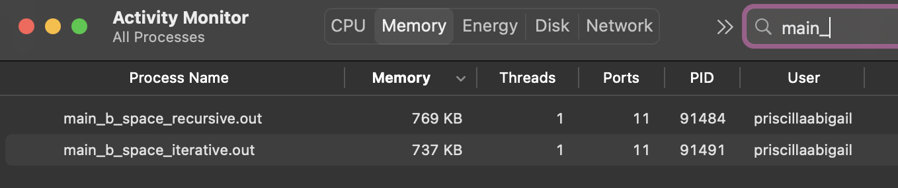

# <b> Fibonacci Benchmark </b>

## About
The Fibonacci sequence is a set of integers that starts with a zero, a one, and another one. Then the numbers steadily increases. The sequence follows the rule that each number is equal to the sum of the last two numbers.

To calculate a fibonacci number, we can use 2 methods: Iterative and Recursive. 


## 2 Methods:
### Fibonacci Series using Iterative Method

```c
int iterativeFibonacci(int num){

    int num1 = 0;
    int num2 = 1;
    int output;

    if (num == 0){
        return num1;
    } else if (num == 1){
        return num2;
    } else{
        for(int i = 2; i <= num; i++){
            output = num1 + num2;
            num1 = num2;
            num2 = output;
        }
        return output;
    }
}
```

### Fibonacci Series using Recursive Method

```c
int recursiveFibonacci(int num){

    if (num == 0){
        return 0;
    } else if (num == 1){
        return 1;
    } else{
        return recursiveFibonacci(num-1)+recursiveFibonacci(num-2);
    }

}
```

### To run:
```sh
make test
./main_test.out
```
### Output:
```
The fibonacci number for 10 is 55
The fibonacci number for 10 is 55
The fibonacci number F0 = 0 (iterative), 0 (recursive)
The fibonacci number F1 = 1 (iterative), 1 (recursive)
The fibonacci number F2 = 1 (iterative), 1 (recursive)
The fibonacci number F3 = 2 (iterative), 2 (recursive)
The fibonacci number F4 = 3 (iterative), 3 (recursive)
The fibonacci number F5 = 5 (iterative), 5 (recursive)
The fibonacci number F6 = 8 (iterative), 8 (recursive)
The fibonacci number F7 = 13 (iterative), 13 (recursive)
The fibonacci number F8 = 21 (iterative), 21 (recursive)
The fibonacci number F9 = 34 (iterative), 34 (recursive)
The fibonacci number F10 = 55 (iterative), 55 (recursive)
```


## Benchmark; Time Complexity

### (Recursive)
Run:
```sh
make time-recursive
./main_b_time_recursive.out
```
Output:
```sh
Time elapsed: 0.123928 s
```

### (Iterative)
Run:
```sh
make time-iterative
./main_b_time_iterative.out
```
Output:
```sh
Time elapsed: 0.000007 s
```

** These two results were obtained using the same N value (35).


## Benchmark; Space Complexity

Run:
```sh
make space-recursive
./main_b_space_recursive.out

make space-iterative
./main_b_space_recursive.out
```
Results:



** These two results were obtained using the same N value (2000).


## Conclusion

So to summarize, after comparing the performaces of both the iterative and recursive method, the iterative method is the most effective method overall. As previously shown, the iterative method has both lower time complexity and smaller space complexity. 

